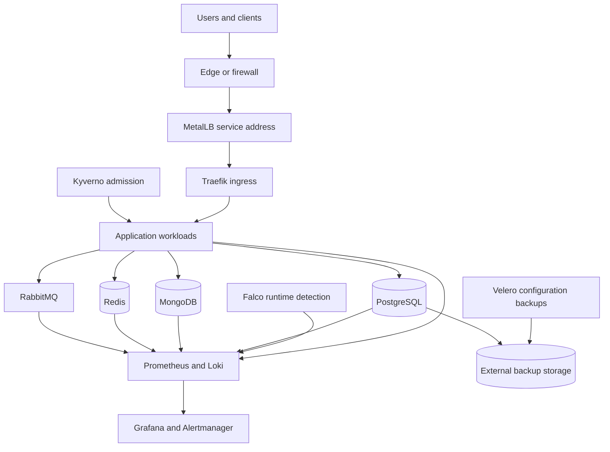

# Production K3s Platform Blueprint

[](https://github.com/lalitmohanjaimini/production-k3s-platform-blueprint/actions/workflows/validate.yml)

A production-minded reference architecture for running application workloads on a compact K3s cluster with clear networking, data, messaging, observability and security boundaries.

> Public and vendor-neutral by design. Every address, domain, secret name and environment value is an example.

## Why this repository exists

Small Kubernetes platforms still need disciplined architecture. This blueprint demonstrates how a lightweight K3s foundation can support stateful services and application delivery without losing operational clarity.

The repository documents decisions and validation steps—not a universal copy-paste production environment.

## Architecture principles

- **Explicit traffic flow** — ingress, load-balancer addresses and service exposure are intentional
- **Stateful systems deserve lifecycle-aware tooling** — use operators where they reduce operational risk
- **Internal by default** — data and messaging services stay private unless exposure is justified
- **Observable operations** — metrics, logs and alerts are part of the platform
- **Layered security** — admission guardrails and runtime detection solve different problems
- **Recoverability over assumptions** — backup and restore procedures must be tested
- **No secrets in Git** — credentials come from an external secret workflow

## Reference topology



## Platform layers

| Layer | Reference choice | Responsibility |
|---|---|---|
| Kubernetes | K3s, three nodes | Scheduling, service discovery and workload lifecycle |
| Load balancing | MetalLB | Stable service addresses on bare-metal or private networks |
| Ingress | Traefik | HTTP/S routing, TLS termination and middleware |
| Relational data | CloudNativePG | PostgreSQL high availability and recovery lifecycle |
| Document data | MongoDB Community Operator | Three-member document database replica set |
| Cache | Redis replication and Sentinel | Authenticated caching, coordination and failover |
| Messaging | RabbitMQ Cluster Operator | Durable asynchronous communication and quorum |
| Metrics | Prometheus Operator and Alertmanager | Collection, recording, alerts and notification routing |
| Logs | Loki HA monolithic and Grafana Alloy | Durable log storage, collection and querying |
| Visualization | Grafana | Dashboards and operational investigation |
| Admission policy | Kyverno | Audit-first workload configuration guardrails |
| Runtime security | Falco Operator | Kernel-level runtime detection across Linux nodes |
| Security access | Kubernetes RBAC | Read-only investigation without Secret access |
| Recovery | Barman Cloud Plugin and Velero | Database PITR plus Kubernetes configuration recovery |

## Repository contents

```text
.
├── docs/
│   ├── architecture.md
│   ├── disaster-recovery.md
│   ├── data-and-messaging.md
│   ├── observability.md
│   ├── operations.md
│   ├── runtime-security.md
│   ├── service-recovery.md
│   └── security.md
├── manifests/
│   ├── backup/
│   ├── metallb/
│   ├── mongodb/
│   ├── network-policies/
│   ├── observability/
│   ├── postgresql/
│   ├── rabbitmq/
│   ├── redis/
│   ├── security/
│   └── traefik/
├── scripts/
│   └── validate.sh
├── SECURITY.md
└── README.md
```

## Quick start

1. Read [Architecture](docs/architecture.md), [Disaster recovery](docs/disaster-recovery.md),
   [Data and messaging](docs/data-and-messaging.md),
   [Observability](docs/observability.md), [Runtime security](docs/runtime-security.md),
   [Security](docs/security.md) and [Operations](docs/operations.md).
2. Replace every `REPLACE_ME` value and documentation-only address.
3. Confirm storage classes, failure domains, DNS, TLS, chart versions, image digests and backup destinations.
4. Validate locally:

```bash
./scripts/validate.sh
```

5. Apply examples deliberately—never blindly—to a non-production cluster first.

## Safety boundaries

Never commit real IP addresses, internal DNS names, credentials, kubeconfigs, certificates, cloud identifiers, customer configuration or encryption keys.

The address range `192.0.2.0/24` used here is reserved for documentation and must be replaced.

## Status

- **Latest release — v0.4.0 (Runtime Security):** Falco Operator, Kyverno HA, audit-first policies,
  isolated security namespaces and least-privilege audit RBAC
- **Current development — v0.5.0 (Backup & Disaster Recovery):** PostgreSQL WAL archiving,
  scheduled base backups, Velero configuration backups, service-specific recovery runbooks
  and backup-health alerts

## Author

**Lalit Mohan Jaimini**  
Technology Leader & Systems Architect

[Portfolio](https://lalitjaimini.com/) · [LinkedIn](https://www.linkedin.com/in/lalitmohanjaimini/) · [GitHub](https://github.com/lalitmohanjaimini)
